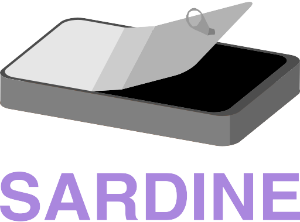

# Sardine

  

Sardine is an open-source framework for developing and executing complex scientific workflows written in C# and built with .NET 8.
It is designed to rapidly create and execute data acquisition and processing desktop applications following a modular approach. 

Sardine allows the reliable execution of dynamic networks of independent modules - where each module can interface with hardware, process data, or both.
It includes integrated logging and UI management, has a low overhead, provides fault-tolerant hardware control, and minimizes downstream delays by
providing dedicated data processing queues for each module. Any .NET class can be easily adapted to a Sardine module, facilitating integration with existing codebases.

**Get Sardine through [NuGet](nugetLink)!**

[Our ready-to-use components are available here.](https://github.com/orger-lab/sardine-components)

---

A change log is available [here](CHANGELOG.md).

Submit crash reports/bugs/feature requests through [GitHub Issues](https://github.com/orger-lab/sardine/issues).

## Quick Start
TODO: this

## License
Sardine is licensed under the [MIT License](LICENSE.md). If you are using software built with Sardine for your research, please cite our publication below.

## Citation
TODO: this

## Contact
- **Point of contact**: Lucas Martins
- **Email**: lucas.martins at neuro.fchampalimaud.org
- **Organization**: Champalimaud Foundation

## Acknowledgments
This work was developed at the Champalimaud Foundation in the Vision to Action laboratory, led by Dr. Michael Orger.
We thank those who used software built with Sardine over the years, for helping to test the framework and providing critical feedback.
Lucas Martins was supported by the PhD fellowships from the Portuguese Fundação para a Ciência e Tecnologia SFRH/BD/129843/2017 and COVID/BD/152726/2022.
